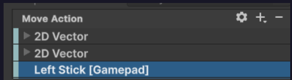
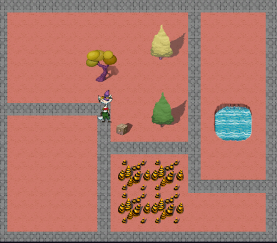

# Robot Repair — Токарчук Любомир
Навчальний проєкт з дисципліни «Геймдизайн та програмування ігрових застосунків». РФКІТ, група КН-3/1, 2026/27.
## Проєкт
Adventure Game: Robot Repair (Unity Technologies), Unity 6.3, URP.
## Як запустити
Відкрити теку проєкту через Unity Hub, редактор 6.3, відкрити сцену рівня, натиснути Play.
## Що зроблено
• Заняття 3: проєкт запущено, перемкнуто набір артів

# __Щоденник розробника:__
### __17.09.2026__ - Юніт 1: персонаж і рух
* __Що зроблено:__ Створив сцену MainScene, додав персонажа та скрипт PlayerController. Налаштував рух персонажа за стрілками та WASD. Створив Tilemap і намалював підлогу за допомогою Tile Palette.
* __Що не вийшло або забрало найбільше часу:__ Найбільше часу забрало створення підлоги, налаштування руху персонажа та перевірка роботи клавіш.
* __Що зрозумів про Update і Time.deltaTime:__ Зрозумів, що Update виконується багато разів під час роботи гри, а Time.deltaTime потрібен для того, щоб швидкість руху не залежала від кількості кадрів за секунду.
* __Що робитиму далі:__ Запишу коротке відео роботи гри та підготую репозиторій до здачі і зроблю "More things to try":
### Gamepad Left Stick: 
### Plan your environment: 

### __24.09.2026__ - Юніт 2: оточення і фізика
* __Що зроблено:__ Додав фізику для персонажа, Rigidbody 2D та Collider 2D. Налаштував зіткнення персонажа з об'єктами рівня та почав працювати з Tilemap Collider 2D.
* __Що не вийшло або забрало найбільше часу:__ Найбільше часу забрало налаштування колайдерів тайлів. Спочатку робот почав відштовхуватися від підлоги після додавання Tilemap Collider 2D.
* __Що зрозумів про FixedUpdate і колайдери:__ FixedUpdate використовується для роботи з фізикою. Колайдери потрібні для визначення зіткнень між об'єктами.
* __Що в рівні вийшло не так, як у фізичному паспорті, і чому:__ Після додавання Tilemap Collider 2D робот почав виштовхуватися з місця. Потрібно правильно налаштувати колайдери тайлів, щоб підлога не заважала руху персонажа.
* __Що робитиму далі:__ Завершу налаштування колайдерів тайлів, перевірю зіткнення з декораціями та протестую рух персонажа по рівню.
